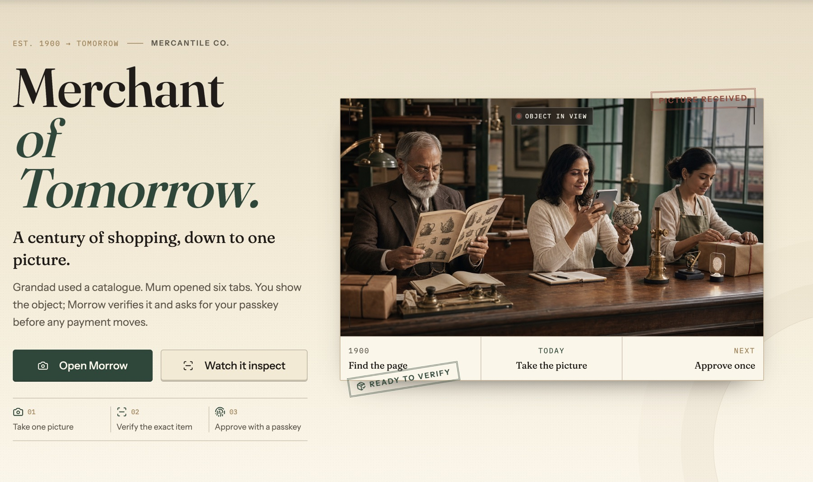
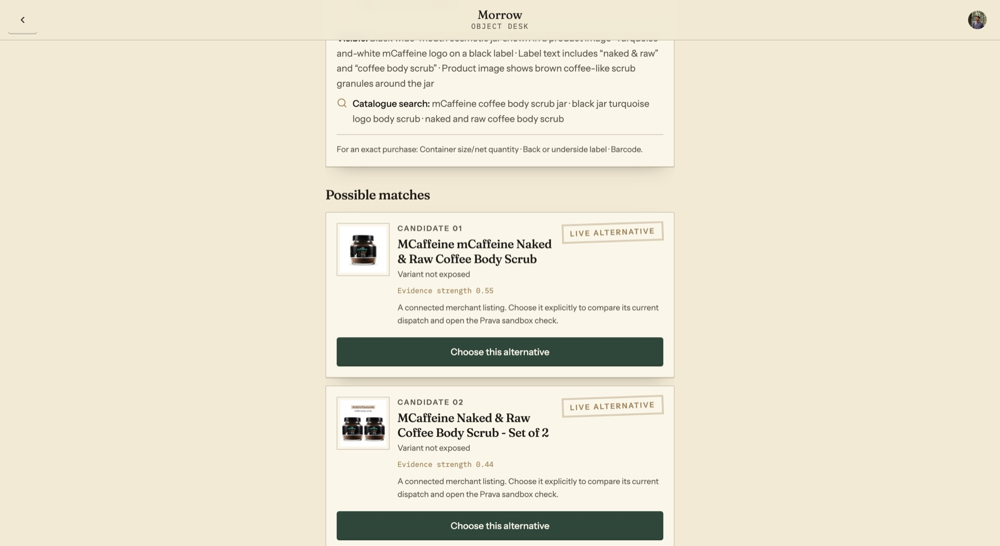
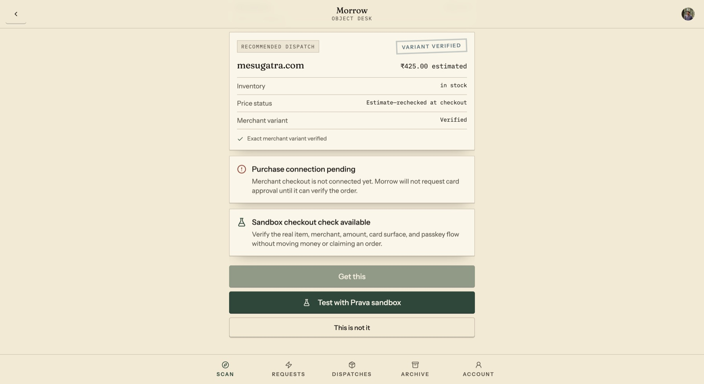
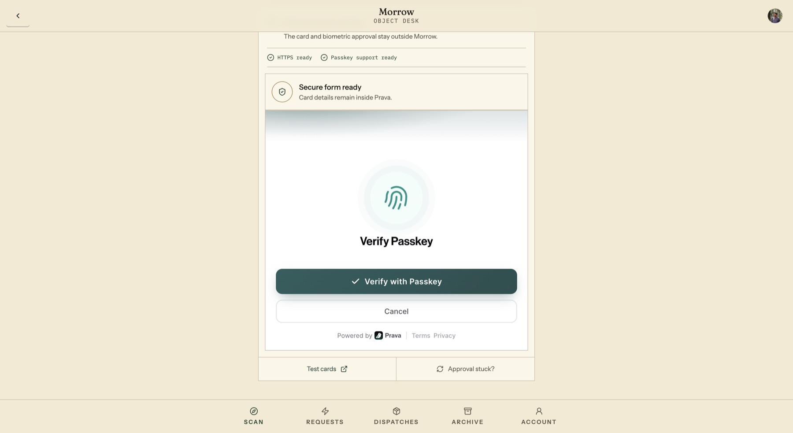
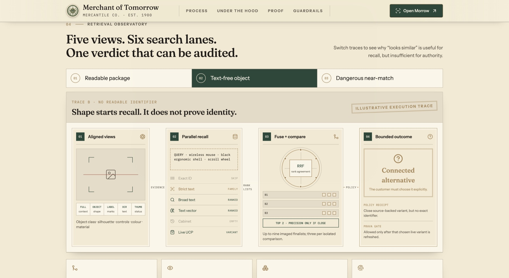
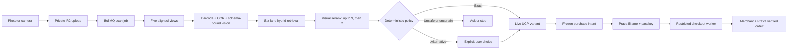

# Morrow — Merchant of Tomorrow

> **Show it. Verify it. Get it.**

Morrow turns one photograph into an evidence-backed product match, a source-backed merchant offer, and one bounded purchase approval through Prava.

<p align="center">
  <a href="https://morrow-red.vercel.app/"><strong>Live product</strong></a>
  ·
  <a href="https://morrow-red.vercel.app/how-it-works"><strong>Technical field manual</strong></a>
  ·
  <a href="https://morrowbackend-production.up.railway.app/health"><strong>API health</strong></a>
</p>

<a href="https://morrow-red.vercel.app/">
  
</a>

## Review it in 90 seconds

1. Open the [live product](https://morrow-red.vercel.app/) and select **Open Morrow**.
2. Photograph or upload a physical product. A clear front label works; a barcode or size panel makes exact verification stronger.
3. Inspect the evidence and candidates. Morrow labels connected alternatives instead of silently calling them exact.
4. Select a source-backed variant and choose **Test with Prava sandbox**.
5. Complete the real Prava card and passkey ceremony. The sandbox result records what happened without claiming that a merchant order was placed.

> **Demo boundary:** **Get this** is enabled only when the restricted merchant-checkout executor is connected. The sandbox path proves the product, merchant, amount, secure card surface, passkey, and scoped credential—without moving money or inventing an order.

## The demo, frame by frame

### 01 — Show it

Morrow keeps useful live catalogue references even when the photograph cannot prove an exact SKU. The buyer must explicitly choose an alternative.



### 02 — Verify it

The selected merchant variant is refreshed for stock, price, currency, and identity before approval. Production checkout remains visibly gated when its restricted executor is absent.



### 03 — Get it

Prava owns the secure card iframe and WebAuthn ceremony. Raw card data and biometric approval remain outside Morrow.



## What is technically different

| Mechanism                              | Why it exists                                                                                                                             |
| -------------------------------------- | ----------------------------------------------------------------------------------------------------------------------------------------- |
| **Five aligned image views**           | Full frame, object, label, OCR, and thumbnail views isolate different evidence without repeatedly decoding the upload.                    |
| **Six retrieval lanes**                | Identifiers, strict text, broad lexical recall, embeddings, prior confirmations, and live UCP catalogues search independently.            |
| **Rank fusion + bounded reranking**    | Reciprocal-rank fusion rewards agreement; at most nine imaged finalists are compared, with a precision pass reserved for the closest two. |
| **Evidence ledger**                    | Every claim keeps its source, confidence, image, and model or decoder provenance.                                                         |
| **Deterministic contradiction policy** | Barcode, model, size, variant, voltage, connector, region, and compatibility conflicts can override every soft similarity score.          |
| **Durable scan state machine**         | API requests start work; PostgreSQL, Redis, BullMQ, and SSE own progress, retries, and recovery.                                          |
| **Spend-aware inference**              | Provider token usage is attributed per user, priced from a versioned rate card, and stopped by a server-enforced allowance.               |
| **Prava downstream of verification**   | A model can observe; only policy can verify; only the user can approve; only the restricted worker can attempt checkout.                  |

<a href="https://morrow-red.vercel.app/how-it-works">
  
</a>

## System path



**Trust line:** multimodal models observe → deterministic code verifies → the customer chooses → Prava authorises → the restricted worker reconciles.

## Prava is the transaction boundary

Morrow uses the **Prava SDK + REST API** application integration, not Prava Pay MCP or CLI.

1. The API freezes one product, merchant, quantity, currency, amount cap, and expiry.
2. The backend creates an embedded Prava session with its server-only key.
3. `@prava-sdk/core` mounts Prava's PCI-safe iframe using the returned URL verbatim.
4. The user enters a card and approves with a real device passkey inside Prava.
5. Morrow polls the payment result server-to-server. One-time credentials never reach the normal browser or logs.
6. A result is reported to Prava only after a definitive merchant attempt. No merchant order ID means no completed order.

The public Prava documentation does not expose a callable Browser Harness contract. Morrow therefore keeps production checkout behind a strictly validated private executor adapter and provides a clearly labelled sandbox approval exercise when that adapter is unavailable. See [the complete Prava lifecycle](docs/prava-integration.md).

## What is real—and what is bounded

| Working end to end                                      | Deliberately bounded                                       |
| ------------------------------------------------------- | ---------------------------------------------------------- |
| Camera and file uploads to private R2                   | Canonical reference coverage is curated and disclosed      |
| Sharp preprocessing, ZXing barcode, Tesseract OCR       | Merchant coverage depends on live UCP support and stock    |
| Structured multimodal observation and visual comparison | Connected alternatives are never promoted to exact         |
| Hybrid PostgreSQL/pgvector/history/UCP retrieval        | Compatibility data is seeded only for supported categories |
| Live Shopify UCP product and variant normalization      | Production checkout requires a Prava-approved executor     |
| Deterministic offer, budget, and variant policy         | Sandbox approval moves no real money and claims no order   |
| Real Prava sandbox session, card iframe, and WebAuthn   | Post-purchase tracking remains provider-dependent          |
| Clerk ownership checks, audit records, rate limits, SSE | Illustrative records can never cross the payment gate      |

## Deployment map

```text
Vercel                                  Railway
┌──────────────────────────┐            ┌────────────────────────────────────┐
│ TanStack Start web app   │  REST/SSE  │ Fastify API                        │
│ Camera-first PWA         ├───────────►│ BullMQ recognition/checkout worker │
│ Clerk + Prava SDK        │            │ PostgreSQL + pgvector + Redis      │
└──────────────────────────┘            │ R2 + OpenAI + Shopify UCP + Prava  │
                                        └────────────────────────────────────┘
```

| Boundary    | Technology                                                                    |
| ----------- | ----------------------------------------------------------------------------- |
| Web         | TanStack Start, React, TypeScript, Tailwind, Clerk, Vercel                    |
| API         | Fastify, Zod, JWT/JWKS ownership checks, Railway                              |
| Worker      | BullMQ, Redis, bounded retries, restricted checkout concurrency               |
| Data        | PostgreSQL, pgvector, Cloudflare R2, encrypted account data                   |
| Recognition | OpenAI multimodal models and embeddings, Sharp, ZXing, Tesseract              |
| Commerce    | Shopify Global Catalog, Storefront UCP/Cart tools, deterministic offer policy |
| Payment     | Prava SDK/API, embedded secure iframe, WebAuthn/passkey, scoped credentials   |
| Operations  | Sentry, OpenTelemetry, Prometheus metrics, audit events                       |

## Run locally

Requirements: [Bun](https://bun.sh), PostgreSQL with `pgvector`, Redis, and an R2-compatible bucket.

```sh
bun install
cp .env.example .env
cp backend/.env.example backend/.env
bun run db:migrate
```

Run each process in its own terminal:

```sh
bun run dev:web
bun run dev:api
bun run dev:worker
```

The API listens on `http://localhost:3001`; its OpenAPI explorer is at `/docs`. Environment files contain placeholders only. Browser-safe keys use the `VITE_` prefix; Prava, OpenAI, R2, database, Redis, encryption, and checkout-executor secrets remain server-only.

## Verify the repository

```sh
bun run check
```

This builds the web application, type-checks the backend, lints the workspace, runs the complete policy suite, and checks patch whitespace. The current suite contains **83 passing tests** covering recognition, retrieval fusion, UCP normalization, offer policy, Prava state compatibility, image preparation, usage accounting, and security boundaries.

## Repository guide

```text
backend/
  database/migrations/   PostgreSQL + pgvector schema
  railway/               API and worker deploy definitions
  src/apps/              Fastify API and BullMQ worker
  src/integrations/      OpenAI, Shopify UCP, R2, and Prava boundaries
  src/modules/           Recognition, offers, checkout, orders, cabinet, audit
  tests/                 Deterministic policy and integration-contract tests
docs/                    Architecture and review notes
scripts/                 Migrations, UCP probes, evaluation, build, quality
src/features/            Scan, payment, archive, cabinet, and account domains
src/components/morrow/   Product-specific presentation
src/components/ui/       Shared controls
src/routes/               TanStack route composition
src/theme/                Tokens, layout, motion, and mercantile patterns
```

### Reviewer notes

- [Recognition system and evaluation](docs/recognition-system.md)
- [Prava SDK/API integration](docs/prava-integration.md)
- [Merchant and UCP coverage](docs/merchant-coverage.md)
- [Vercel and Railway deployment](docs/deployment.md)
- [Backend operations](backend/README.md)

Only placeholders belong in committed environment files. Any secret disclosed through chat, screenshots, logs, or version control must be rotated before use.
