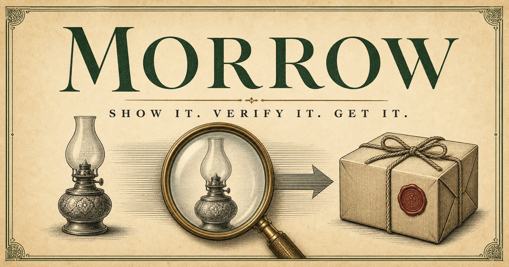

# Morrow

> **Show it. Verify it. Get it.**

Morrow is the buy button for the physical world—a visual-commerce companion that turns any object into a clear, trusted path to purchase.

Take a photograph. Share a screenshot. Scan a label. Paste a link. Morrow identifies what you mean, checks the exact variant, compares reliable sellers, and prepares one bounded purchase through Prava.



## Commerce should not require the right words

People rarely think in catalogue titles, model codes, or search keywords. They think:

- “I need another one of these.”
- “Find the shoes in this screenshot.”
- “What is this replacement part?”
- “I want the pillow from that hotel.”
- “Get the correct cartridge for my printer.”

Traditional shopping makes the customer translate that intent into the language of a search box. Morrow starts with the thing itself.

## One natural action, end to end

|                | Morrow does                                                           | You get                                                  |
| -------------- | --------------------------------------------------------------------- | -------------------------------------------------------- |
| **Show it**    | Reads the object, packaging, label, code, link, or description        | A product candidate without keyword hunting              |
| **Verify it**  | Checks identifiers, variant, size, compatibility, and visual evidence | A clear exact, alternative, or uncertain result          |
| **Choose it**  | Compares delivered price, stock, returns, timing, and seller trust    | One recommended dispatch with the trade-offs visible     |
| **Approve it** | Requests a short-lived limit for one item and purpose                 | Control without handing over the whole wallet            |
| **Get it**     | Confirms the resulting order and delivery record                      | A verifiable purchase, not an ambiguous checkout attempt |

## Why Morrow feels different

### Visual intent first

Start with what you can see—not what you happen to know it is called.

### Exactness over resemblance

A near match is never quietly promoted to an exact match. Morrow shows the evidence and labels uncertainty plainly.

### Permission with boundaries

Payment authority can be limited by product, amount, merchant, purpose, and time through Prava.

### A recommendation you can inspect

The chosen seller is accompanied by price, delivery, stock, trust, and returns—not a mysterious “best” badge.

## Built for everyday discovery

Morrow can begin with:

- a physical object in front of you;
- a screenshot from a conversation or social post;
- a barcode, label, model number, or serial number;
- a product link that needs verification;
- a spoken or typed description;
- a compatible replacement for something you already own.

From skincare refills and printer cartridges to furniture, fashion, hotel goods, and hard-to-name parts, the interaction stays the same: show it once and let the evidence do the work.

## Trust is part of the product

Morrow is designed around five promises:

1. **Exact and similar are different states.** The interface never hides that distinction.
2. **Uncertainty stops the purchase.** More evidence or confirmation is required.
3. **The customer remains in control.** Approval is specific, limited, and short-lived.
4. **Merchant claims remain merchant claims.** Stock, price, and delivery are presented without false guarantees.
5. **Completion is verifiable.** A successful checkout produces an order record the customer can inspect.

## A century-old company from tomorrow

Morrow’s visual world imagines an Edwardian mail-order company that spent the next 125 years perfecting visual commerce.

The interface blends:

- parchment, ivory, bottle green, dark ink, antique brass, and postal red;
- engraved catalogues, railway tickets, parcel ledgers, and scientific instruments;
- modern camera-first layouts, large touch targets, and concise interaction;
- paper-feed, inspection-line, dial, receipt, and stamp motion.

The result is warm, tactile, and quietly advanced—never steampunk, distressed, or generic software chrome.

## Experience the prototype

The current experience includes:

- a responsive marketing story;
- an interactive “Choose an object” inspection demonstration;
- exact-match evidence and alternative classification;
- seller and dispatch comparison;
- bounded purchase approval;
- secured order confirmation;
- dedicated mobile scan and order states.

The products, merchants, prices, and orders in the demonstration are illustrative.

## Run Morrow locally

Install [Bun](https://bun.sh), then:

```sh
bun install
bun run dev
```

Open `http://localhost:8080/`.

## Production checks

```sh
bun run build
bun run lint
```

The production build creates Cloudflare-compatible output and a deployment-ready Sites bundle.

## Technology

Morrow is built with React 19, TypeScript, TanStack Start, TanStack Router, Vite, Nitro, Tailwind CSS 4, Radix UI, Lucide icons, and Bun.

```text
src/routes/                 Pages and metadata
src/components/morrow/     Product-specific interface sections
src/components/ui/         Reusable interface primitives
src/assets/                Brand and catalogue artwork
src/styles.css             Tokens, styling, and motion language
public/                    Icons, manifest, and social preview
```

## Product language

- Company name: **Morrow Mercantile Co.**
- Product name: **Morrow**
- Brand line: **Show it. Verify it. Get it.**
- Entry action: **Open Morrow**
- Purchase action: **Get this**

For contribution and implementation guidance, read [`AGENTS.md`](AGENTS.md).
